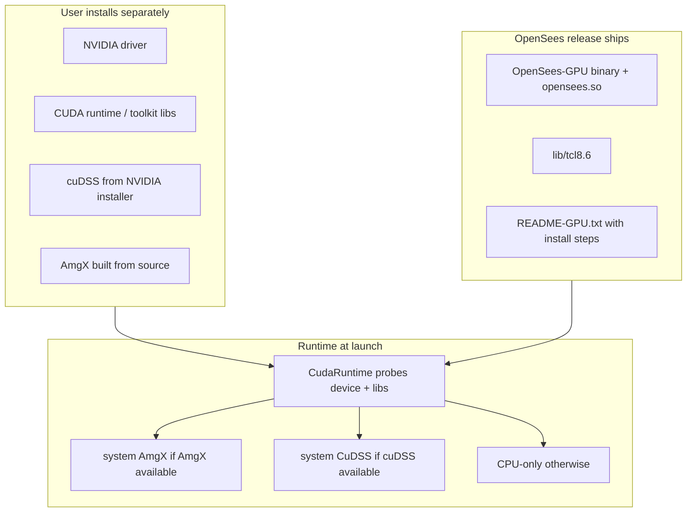
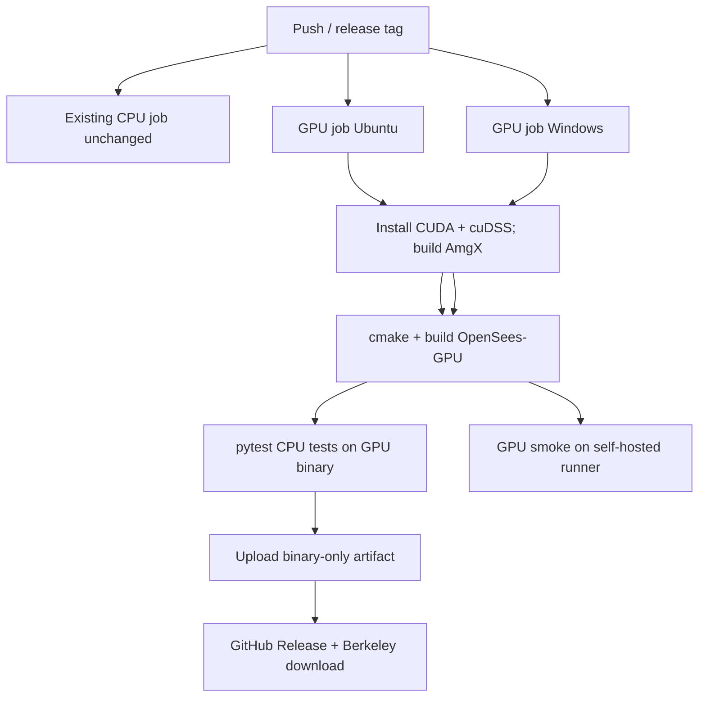

# GPU-Enabled OpenSees Release Plan

## Goal

End users download a prebuilt **OpenSees-GPU** (Tcl + OpenSeesPy) that:

- **Does not require compiling OpenSees**
- **Uses GPU features when the user has installed the required stack** (NVIDIA driver, CUDA runtime, cuDSS, AmgX)
- **Does not redistribute proprietary NVIDIA libraries** (cuDSS, CUDA runtime) — users install those themselves
- **Falls back cleanly** when GPU hardware or a backend library is missing (same binary; clear startup status and errors)
- **Ships via upstream OpenSees** as an additional official release artifact alongside the existing CPU build

This follows a **hybrid** of OpenSees history (CuSP as optional add-on) and COMSOL’s “point to your CUDA/cuDSS install” model — adapted for a single prebuilt binary that **dynamically links** against user-provided libraries.

## Distribution model (revised)



| Who | Responsibility |
|-----|----------------|
| **OpenSees CI** | Build and publish `OpenSees-GPU` linked against CUDA/cuDSS/AmgX (same as today’s developer build, but automated) |
| **User** | Install NVIDIA driver; install cuDSS from [NVIDIA cuDSS downloads](https://developer.nvidia.com/cudss-downloads); build/install AmgX; set `LD_LIBRARY_PATH` / `PATH` if libs are not in default locations |
| **OpenSees runtime** | Detect GPU + libraries; enable commands only when backend is usable; print actionable errors otherwise |

**Users do not compile OpenSees.** They may need to **build AmgX once** (open source, no redistribution issue) and **run NVIDIA installers** for cuDSS — same as many HPC/research workflows.

## Code organization (no folder reorg)

Keep existing layout — matches OpenSees conventions (`sparseCUDA/` for SOEs, `analysis/integrator/` for GPU integrators). Phase 1 adds `CudaRuntime.h/cpp` under [`SRC/system_of_eqn/linearSOE/sparseCUDA/`](SRC/system_of_eqn/linearSOE/sparseCUDA/). No `SRC/Cuda` consolidation in Phases 1–3.

## Current state (baseline)

| Area | Today |
|------|-------|
| Official releases | CPU-only via [`.github/workflows/build_cmake.yml`](.github/workflows/build_cmake.yml) |
| CUDA integration | Compile-time fork in [`CMakeLists.txt`](CMakeLists.txt): `HAVE_CUDA` → `_CUDA` / `_NO_CUDA` |
| Commands | Gated by `#ifdef _CUDA`, `_AMGX`, `_CUDSS` in [`SRC/tcl/commands.cpp`](SRC/tcl/commands.cpp), [`SRC/interpreter/OpenSeesCommands.cpp`](SRC/interpreter/OpenSeesCommands.cpp) |
| Windows cuDSS | Explicitly disabled (lines 639–646) despite NVIDIA shipping Windows cuDSS |
| Runtime probe | None — only `cudaGetDeviceCount` inside solver init |
| Legacy GPU | [`CuSPSolver`](SRC/system_of_eqn/linearSOE/sparseGEN/CuSPSolver.cpp) — separate DLL model; not part of this plan |

## Phase 1 — Runtime availability layer

Add [`CudaRuntime.h`](SRC/system_of_eqn/linearSOE/sparseCUDA/CudaRuntime.h) / [`CudaRuntime.cpp`](SRC/system_of_eqn/linearSOE/sparseCUDA/CudaRuntime.cpp) compiled into `OPS_Cuda`.

**API (extend beyond GPU device probe):**

1. `bool opsCudaRuntimeAvailable()` — NVIDIA driver + at least one device (`cudaGetDeviceCount` / `cudaFree(0)`).
2. `bool opsCudssAvailable()` — linked library loadable and minimal sanity check (or defer to first CuDSS call with cached failure).
3. `bool opsAmgxAvailable()` — same for AmgX backend.
4. `void opsCudaLogStartupStatus()` — called from [`SRC/tcl/tclMain.cpp`](SRC/tcl/tclMain.cpp) and Python init:

   ```
   OpenSees GPU: 1 device detected
   OpenSees GPU backends: AmgX=available, cuDSS=not found (install from ...)
   ```

5. `bool opsCudaRequireBackend(const char* feature)` — checks device **and** the specific backend before factory dispatch.

**Command gating** at [`commands.cpp`](SRC/tcl/commands.cpp), [`OpenSeesCommands.cpp`](SRC/interpreter/OpenSeesCommands.cpp), [`FEM_ObjectBrokerAllClasses.cpp`](SRC/actor/objectBroker/FEM_ObjectBrokerAllClasses.cpp):

- Keep `#ifdef _AMGX` / `_CUDSS` for “this build was linked with backend support.”
- Add runtime checks: device present + backend library usable.
- cuDSS integrators (`CudaKRAlpha*`) require `_CUDSS` **and** `opsCudssAvailable()`.

## Phase 2 — CMake: dynamic linking + discovery (no bundling)

New [`cmake/OpenSeesCUDADeps.cmake`](cmake/OpenSeesCUDADeps.cmake) centralizes GPU dependency logic.

| Dependency | Build-time (CI or advanced users) | Runtime (end users) |
|------------|-----------------------------------|---------------------|
| CUDA | `CUDAToolkit_ROOT` or auto-detect nvcc | Driver + `libcudart` on `LD_LIBRARY_PATH` / default system paths |
| cuDSS | `find_package(cudss)` + dynamic link `cudss` | User runs NVIDIA cuDSS installer; libs in `/usr/lib/.../libcudss/` or Windows install dir |
| AmgX | `AMGX_NO_MPI_DIR` pointing to built library | User builds AmgX from source; shared or static link — prefer **shared** (`libamgx.so`) for clearer “install AmgX” story |

**Changes from original plan (removed):**

- ~~`OPENSEES_CUDA_RELEASE` bundling of NVIDIA redistributables~~
- ~~Post-build copy of `cudart64_*.dll`, `libcudss.so` into release tarball~~

**Changes (added):**

- **Dynamic linking** to `CUDA::cudart`, `cudss`, and AmgX (evaluate switching AmgX from static `libamgx.a` to shared `libamgx.so` for consistency with “user installs AmgX”).
- **Documented search paths** in README: Linux cuDSS default paths, Windows cuDSS install dir, AmgX build output.
- **Optional env overrides** (for power users, COMSOL-style):
  - `OPENSEES_CUDSS_DIR` — prepend to loader search path at startup (set in `CudaRuntime` init via `dlopen` path or documented `LD_LIBRARY_PATH`)
  - `OPENSEES_AMGX_DIR` — same for AmgX
- **Windows cuDSS** — remove hard block in [`CMakeLists.txt`](CMakeLists.txt); add Windows `CUDSS_HINTS` from NVIDIA installer layout.

**RPATH:** use `$ORIGIN`-relative RPATH only for **OpenSees-owned** libs (e.g. `opensees.so`), **not** for redistributing NVIDIA libs.

## Phase 3 — CI and official release artifacts

CI **installs** CUDA + cuDSS + builds AmgX on the runner (same deps users need), **builds** OpenSees-GPU, **does not package** NVIDIA binaries into the artifact.



**Artifact contents (per platform):**

- `OpenSees-GPU` / `OpenSees-GPU.exe`
- `opensees.so` / `opensees.pyd`
- `lib/tcl8.6/`
- `README-GPU.txt` — **step-by-step user install** for driver, cuDSS, AmgX, env vars, version compatibility matrix

**Not in artifact:** `libcudss`, `libcudart`, AmgX libs (user-provided).

## Phase 4 — Documentation and upstream PR

User-facing docs are **critical** in this model (replacing what bundling would have hidden):

1. **Prerequisites checklist** — driver version, CUDA/cuDSS version matrix, AmgX build instructions (link to NVIDIA/AmgX repo, pinned commit).
2. **Install order** — driver → cuDSS installer → build AmgX → download OpenSees-GPU → set paths → verify startup banner.
3. **Feature matrix** — which commands need which backend (`AmgX` vs `CuDSS` vs both for integrators).
4. **Troubleshooting** — `LD_LIBRARY_PATH`, “cuDSS not found”, driver too old, WSL2 notes.
5. **Developer note** — unchanged CPU build; GPU build uses `OpenSeesCUDADeps.cmake`.

**Upstream PR sequencing:**

1. Runtime layer + guards (Phase 1)
2. Windows cuDSS CMake + dynamic-link cleanup (Phase 2)
3. `OpenSeesCUDADeps.cmake` + AmgX shared-link evaluation
4. CI GPU jobs + binary-only artifacts (Phase 3)
5. User install documentation (Phase 4)

## Phase 5 — Future (out of scope)

- **`dlopen` backends** — true optional loading without link-time dependency on cuDSS/AmgX (closer to legacy CuSP DLL model; enables CPU binary with zero NVIDIA link deps)
- Merge GPU and CPU into one default download
- macOS GPU (defer)
- `OPS_Cuda_Parallel` for OpenSeesSP/MP

## Risks and mitigations

| Risk | Mitigation |
|------|------------|
| User version mismatch (cuDSS vs build) | Document pinned versions; startup prints linked/expected versions; ABI-safe dynamic link |
| AmgX build friction for users | Clear one-page build script; consider conda/package later |
| Missing libs at runtime | Startup banner lists missing backends; `opsCudaRequireBackend` gives install URL |
| CI differs from user machine | README versions match CI; smoke tests on self-hosted GPU runner |
| AmgX static vs shared link | Evaluate shared lib in Phase 2 for consistent “install then run” story |

## Success criteria

- User **without** cuDSS/AmgX/GPU: downloads OpenSees-GPU, runs CPU examples — no crash; startup lists missing backends.
- User **with** full stack installed per README: runs [`tests/cuda_explicit_alpha_tp_smoke.py`](tests/cuda_explicit_alpha_tp_smoke.py) without compiling OpenSees.
- **No NVIDIA proprietary libraries** in OpenSees release artifacts.
- Official release page lists OpenSees-GPU alongside CPU build, with link to GPU prerequisites doc.

## Time estimates (unchanged)

- **Phase 1:** ~4–6 hours
- **Phase 2:** ~6–10 hours (Windows cuDSS + dynamic-link/docs; less work than bundling, possible AmgX shared-link change)
